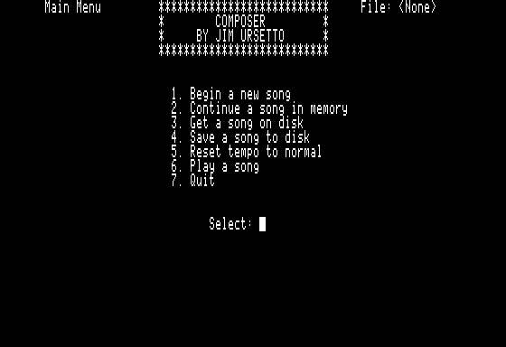
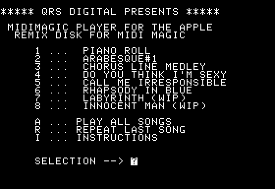
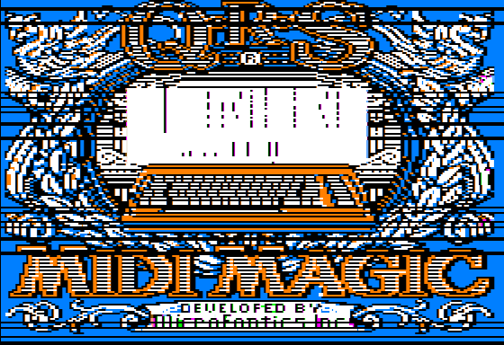

COMPOSER and qrs2midi
========

COMPOSER is a simple composition program I wrote for the Apple //
around 1990. It generates files compatible with the MIDI MAGIC piano roll
driver, which came with the QRS MIDI-MAGIC demo disk and was bundled with a hardware MIDI interface.  COMPOSER can also call into the MIDI-MAGIC driver to play files from
BASIC while editing.



It's possible I reverse-engineered the file format given that this was
just a demo disk, that there are multiple iterations of my data files at
different load addresses with and without headers, and that I was
generally pretty desperate. However the tempo variable and the entry points for
playing a song would have been far too complex for me. So, I suspect they provided a bit of documentation
for hackers.

The original disk is somewhat corrupt; some of the COMPOSER versions have issues.
Also, the MIDI-MAGIC program contains bad sectors at the end and crashes on run.

The intent of this project is to recover as much data as possible, decode the
file formats, and convert them to MIDI files. A secondary goal is to
disassemble and understand MIDI-MAGIC enough to patch it to run again --
although we can't test it with real MIDI hardware, we can verify the tempo of
our MIDI files are correct and preserve something (in essence) that seems
unpreserved. In the end both goals were accomplished.



First, I've implemented a MIDI converter in [qrs2midi.py](qrs2midi.py). Piano roll files in `roll/`
have been converted to `.mid` files in `midi/`. If you start the piano roll in an emulator while you play the midi file, it lines up pretty decently.

Additionally, I've written a patch for the driver in [midi-magic/](midi-magic)
to reimplement the missing disk functionality and get the piano roll
program fully working. Fully annotated source is available there. The static piano roll background is unfortunately still corrupt.



A repaired disk is provided as `midi magic remix.dsk`. This contains the original demo files and will run MIDI-MAGIC on startup. If you Ctrl-C while it's starting, you can `RUN COMPOSER`. I also included a couple files written with COMPOSER, marked with (WIP), that are basically just a few measures of music I laboriously entered before giving up.

I used The Flaming Bird Disassembler to diassassemble and annotate the source.
The program `tfbd.py` decodes its binary template files (containing comments, labels,
etc.) and generates text output, which is stored in version control. I tried using radare2, but it's just too touchy and doesn't handle 6502 well.

Files in this repository
------------------------

- `COMPOSER.BAS`: Latest version of COMPOSER. Old versions [2-6] are in unique commits.
- `qrs2midi.py`: Translate piano roll files to MIDI.
   - Use `init.sh` and `source venv/bin/activate` to configure your environment to run it.
- `midi-magic/`: Disassembly and repair of MIDI-MAGIC driver.
- `midi magic demo.dsk`: Original, corrupt disk.
- `midi magic remix.dsk`: Repaired and cleaned up disk. Conserved, not preserved.
- `roll/`: Original piano roll files.
- `midi/`: Piano roll files converted to MIDI.

Files on original disk
----------------------

- COMPOSER2.BAS -- Expects loaded files at $4000; BSAVEs without header (at $4040). Music data starts with FF 0A. Accepts notes like C0, A#3, B5. Stops notes by numeric value.
- COMPOSER3.BAS -- Relocates to $3000. Loads and saves files without header at $5000. Music data starts with FF 0A 00. Sets $99b to $50 and $997 to $00 (to tell driver where data is). Adds hidden Adjust Tempo option (8). Stops notes by name.
- COMPOSER4.BAS -- Sets $4FBD..4FBF to 0. This corresponds exactly in location to this file's 00 00 00 end of BASIC file signature (!!) -- perhaps a workaround for the end of file corruption plaguing these programs. Removed in COMPOSER6.
- COMPOSER5.BAS -- lost
- COMPOSER6.BAS -- Relocates to $4000, expects files at $5000, data at $503F ($99b,$997 = $503F). Note default data location in driver is $403F (not $4040). If filename does NOT begin with "^^", playback starts at $5000. Saves with header. Note parsing looks buggy due to use of MID$: octave will always be 0 for sharps. Tempo is at $4038 instead of $5038, which is a bug and explains why the header REMs have a control character at file offset $37 -- BASIC area is corrupted at runtime.
- MIDI-MAGIC.BIN -- serial port midi driver and piano roll file player. Crashes on BRUN.
- A bunch of piano roll files, all starting with `^`.
- The file starting with `@` is displayed as the disk title.

Recovery
--------

- COMPOSER6.BAS was recovered from /DOUBLEDOS, but was a slightly earlier (non-working) version.
  We recovered it from the corrupt disk by repairing the file length and setting last line pointer to NULL. See Notes below.
- COMPOSER3 and COMPOSER4 were also recovered by repairing the files. Note that COMPOSER4 contains what looks like self-repairing code to fix this at runtime! I almost understood the problem.
- MIDI-MAGIC has bad sectors ($00 bytes) from $0BFE - $0DFF, in the middle of code. Much is actually zeroed data space, so only $B0 bytes of code were lost, which obtain the song list and disk name from disk.
- MIDIMAGIC (from /DOUBLEDOS) is identical to MIDI-MAGIC until $0A00 (and truncated there) and so is not useful for recovery.

Entry points
------------

These are called from BASIC to play a song. Their actual meaning
can be seen in the disassembly output.

    $097D
    $0A36

File format
-----------

Info files are used only by COMPOSER and are not necessary to decode the music. They are TXT files containing 3 integer values:
 - NT (number of notes entered, excluding rests and note off); completely unused, even for display.
 - NC (byte index of next note)
 - TM (tempo).

### Header

The header on the demo files consists of 64 zero bytes ($4000 - $403F in memory).

We know tempo is stored at runtime at $4038 (but is zero in the file). No other
locations in this header are used, even for temporary storage. A few
of my files were saved with some data from $5000-$503F; probably
BASIC file data that overlapped the music file during a period
where the BASIC program was improperly relocated.

### Title

All songs playable by the official player begin with `^`. The second character is the tempo (AND #$7F, since it uses high-ASCII). The driver always does a 'BLOAD ^' followed by the rest of the filename stored in the filename table, starting from the byte after the tempo. Thus, songs are
displayed with an extra space character in the song list.

### Data

Official files start data with FF 0F. My files start with either FF 0F, FF 0A, FF 0F 00 (?), or FF 0A 00 depending
on which version of COMPOSE generated them.  In practice I don't see any existing files with FF 0A 00, which is the signature of COMPOSER6. Furthermore, 00 is an illegal value.

These values don't correspond to MIDI messages. MIDI messages have no DURATION, just NOTE ON and OFF. MIDI Note on/off are 3 bytes and include a KEY byte and VELOCITY byte and CHANNEL. In particular, MIDI 0xFF is hard reset.  The piano roll files use a fixed velocity of 64, explicit delay values in ticks (FF tickval), and explicit note on and note off.

`qrs2midi.py` implements a piano roll decoder and is the best
place to see how this works.

#### Data in COMPOSER

Note on is a single byte; NOTENUM.  Note off is a single byte with the high bit set, NOTENUM | 0x80.

A REST (really, a time step) is generated with the pair (FF, DURATION) where DURATION is (arbitrarily?) 20x the number entered as input. Empirically, step values are much higher in COMPOSER than in the official files (often we see steps of 1 or 2, whereas my durations are 10x higher). It is possible setting the tempo too high is too taxing or disallows high polyphony, for the same reason high jiffies used to be a problem in Linux.)

Note numbers (NOTENUM) range from 36 to 96 ($24 to $60) in COMPOSER4, or 36 to 107 ($24 to $6b) in COMPOSER6.
Note off for a particular NOTENUM is generated by setting bit 7 in NOTENUM.

End of song is represented by (255, 255).

Generally, you issue a sequence of blocks consisting of a time step, note offs and note ons.

#### Data in official files

Official files start with FF 0F and end with FF 0F, likely to produce a nice lead-in and lead-out time.

End of file is always FF FF. There may be a bit of garbage after that.

Note range isn't that high. Observed low of $24 and high of $60 (so note off $A4 - $E0). That corresponds to my COMPOSER4 limits. Since this would have been hard for me to verify at the time, it's plausible that I had a bit of documentation. There is no velocity control--it's a true old-time piano roll.

"DO YOU THINK I'M SEXY" has some assembly language garbage at the end that looks like a tight hardware timing loop. It appears that offset $20FC and later got mixed up with another file.

Missing sectors
---------------

The driver on my disk is corrupt and, as far as I can tell, is probably
missing just the piece which loads filenames from the catalog into the
disk name and filename table. This could be reimplemented.

Notes
-----

COMPOSER relocates itself from $801 to $4001 (via poke 104,64 (0068: 40) +
LOAD). This is because MIDI-MAGIC resides at $800. That's also why music data
files were relocated from $4000 to $5000. (Not sure why we didn't relocate
COMPOSER to $6000 and keep the music files the same; this would have allowed
playing native QRS music files from within COMPOSER.) Even though the file
header apparently has a load address of $4001 on disk, BASIC ignores this and
will load it at the current value of $67-$68.
- In the earliest version, COMPOSER is at $3001. I'm guessing I moved it to $4001
  to avoid accidentally wiping out the program with HGR.
- COMPOSER6 is $1006 bytes long, and will overlap the start of the music file at $5000!
  If you load a music file, the very end of the BASIC program gets corrupted.

If we had left the music file at $4000, data at $4040 and relocated COMPOSER to $1800,
we would have plenty of token space and have been able to play official files.

Addresses 174,175 (AF.B0) contain the address + 1 of the last byte of the
Applesoft program currently loaded in memory. Some saved versions of COMPOSER
have either/both of the following problems: the length is 1 less than the correct value,
and the last byte contains a random value instead of 00. In other words, a
BASIC program normally ends in 00 00 00 where 00 is the end-of-statement token and
the 00 00 is a NULL address indicating end of linked list. Instead, COMPOSER6
had 00 0b <EOF>, so Apple Commander fails to load it (out of bounds access as it
expected 00 0b xx), and AppleSoft may fail to LIST based on what's in $xx0b in
memory. To fix this, we LOAD the file, increment the 16-bit address in $AF by 1,
then NULL out the linked list pointer.

```
]LOAD COMPOSER6,D1
]CALL-151
*AF.B0
00AF: 06
00B0: 18
*AF: 07
*1805: 00 00
*SAVE COMPOSER6,D2
```

COMPOSER4 actually writes 00 00 00 to the end of file location in memory at startup time (the address is hardcoded). Obviously, this bit me at the time, but I didn't know how to properly fix it. I'm guessing the music file clobbered the last pointer at some point, then I saved the program. I don't know how the program length was corrupted though.

Driver disassembly
------------------

Driver was disassembled using TFBD by Ferox and its Merlin-compatible
source files are in the [midi-magic](midi-magic) subdir along with
commentary. The file `tasks.py` will pull source files from my working disk
and commit them to git, and `tfbd.py` will decode TFBD template files to text
for storage in git.

```
zp $00 : SONGPTR -- points to current byte in song
zp $04,$05: temp used for HGR line pointer
zp $06,$07: temp used for HGR line pointer
zp $08: temp used for current HGR line number
zp $09 : FILENAME points to current filename (apparently, the character after the first ^). CURSONG*32.
    the first byte is also stored in the SSC_STATUS register (?!)
zp $0A : affects roll display. #$FF seems to mean NOTE ON, #$00 NOTE OFF.
zp $0B : ISPLAYING bool: 0 if no song playing, $FF if playing (test is for 0)
$303 : CURSONG whatever's here, it's multiplied by 32 and stored in $09. The currently playing song, I think.
$305 : seems to hold the last key pressed, set to 0 when key is handled.
1236.12F5 ($C0) : low byte of HGR line index (lines 0-191)
12F6.13B5 ($C0) : hi  byte of HGR line index (lines 0-191)
14ac : a CR-terminated string. may be populated near EOF in the bad sectors.
       Surmising this is "DEMO DISK FOR MIDI MAGIC" obtained by scanning catalog for
       file beginning with "@". It is terminated by $8D, but unlike the filename
       table, $A0 padding is not required (but doesn't hurt).
14cc-15cc : a 256-byte (table) containing 8 32-byte entries, 1 per song.
 Each is the filename on disk without the first ^, padded with spaces,
 terminated by CR ($8D) at byte 29. Since the first ^ is implied, filename
 data is 30 bytes long. This matches a standard DOS 3.3 filename,
 which is 30 bytes and space-padded. Note the CR *must* occur at byte 29 as
 the catalog code is hardcoded to look 3 bytes past it for the next filename;
 bytes 30 and 31 are ignored.
 For example, ASC "^ PIANO ROLL" A0 A0 ... 8D. Byte 0 (the second char of
 the full filename) is the file's tempo.
 Song scan terminates at the first 0 byte (at byte 1), or after 256 bytes.

0305 : might hold last key pressed.

750-777, 7d0-7f7 : The last two lines of the screen, animated
with '*' or '.' in each column in some way. Initialized to all '.'.
See $0AB5 (ANIMATE) which oddly has no call to it. I think this
is vestigial debugging output, perhaps made visible by setting
mixed text/HGR mode.
```

Tempo can range from 32 to 159 (a 7-bit range of $7F).
Right arrow DECREASES tempo, implying "tempo" is actually a delay value.
This lines up with tempo display, which moves right on screen as
tempo value gets smaller.

All notes are sent at velocity 64. Note off is sent as NOTE ON + velocity 0,
which the MIDI standard says is equivalent to NOTE OFF. (Some indications
that NOTE OFF is less well supported anyway.)

To send a byte, the code appears to frob the RTS line bit by bit, by
toggling the command register $C08A from #$08 to #$00, which switches
the transmit interrupt bits from Disabled (RTS high) to Disabled (RTS
low). The meaning of the 2 transmit interrupt bits are described at
https://sites.google.com/site/drjohnbmatthews/apple2/ssc -- official
docs omit their definition. I believe this line is either pin 1 or 5
on the //c, not sure which.


### Recovery of MIDI-MAGIC

The last 3 sectors of MIDI-MAGIC are on T04,S0D-0F are corrupt as
track 4 is unreadable. Unfortunately there are no copies of this data elsewhere.

    T22,S08 is "unused" but contains a copy of $0AEF-$0B2C of MIDI-MAGIC.
    T16,S00-03 contains deleted or missing COMPOSER stuff
    T16,S04-0D contains valid assembly of an unknown executable, not the driver
    T14,S00-02 contains garbage (?) data
    T13,S03-09 contains deleted for missing COMPOSER stuff
    T08,S06-0A contains deleted for missing COMPOSER stuff (probably COMPOSER2)
    T04 appears destroyed. It contained MIDI-MAGIC and LOGO data.

### Rewriting of MIDI-MAGIC

This was a proof of concept; manually editing the filename tables before
I created a patch to read it from disk. See the source code for
the actual solution.

```
  13FC: 60                        ; return from badlands without cataloging disk
  14AC: A0 A8 C4 C9 D3 CB A0 CE
        C1 CD C5 A9 8D
  14CC: DE A0 D0 C9 C1 CE CF A0
        D2 CF CC CC A0 A0 A0 A0
        A0 A0 A0 A0 A0 A0 A0 A0
        A0 A0 A0 A0 A0 8D 00 00   ; ASC "^ PIANO ROLL          "8D
  14EC: DE A0 C1 D2 C1 C2 C5 D3
        D1 D5 C5 A3 B1 A0 A0 A0
        A0 A0 A0 A0 A0 A0 A0 A0
        A0 A0 A0 A0 A0 8D 00 00   ; ASC "^ ARABESQUE#1         "8D
BSAVE MFIX,A$13FC,L$200,D2

CALL-151
BLOAD MIDI-MAGIC
BLOAD MFIX,D2
CATALOG,D1
833:2C
836:2C           # avoid zeroing filename structures

```

Further information
-------------------

MIDI MAGIC was apparently written by Bob Kovacs of Microfantics in 1985. QRS Digital probably bought this program for the Apple version of their player piano library.

This disk doesn't appear to be archived anywhere and info is scarce. The player contains this contact information:

    CALL MICROFANTICS INC. (201) 838-5606
    OR WRITE US AT:
    33 ADALIST AVENUE
    BUTLER, NJ 07405

I also found the following at https://homepages.abdn.ac.uk/d.j.benson/pages/html/dx7software.html:

    MICRO W DISTRIBUTING INC
    1342-B Rt. 23, Butler NJ 07405

    MIDI Magic Digital Disks

    Digital music disks from the 10,000 song QRS piano roll library of past and present music. Available for Yamaha and the MIDI DJ sequencer as well as Atari ST, Apple IIC, II+, IIE, Laser 128, Commodore 64/128, PC XT and other popular computers and sequencers. Retail $19.95 (6 song disk), $29.95 (10 song disk). (1988 prices).
